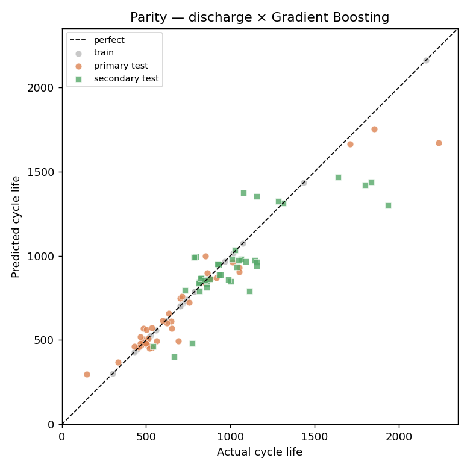
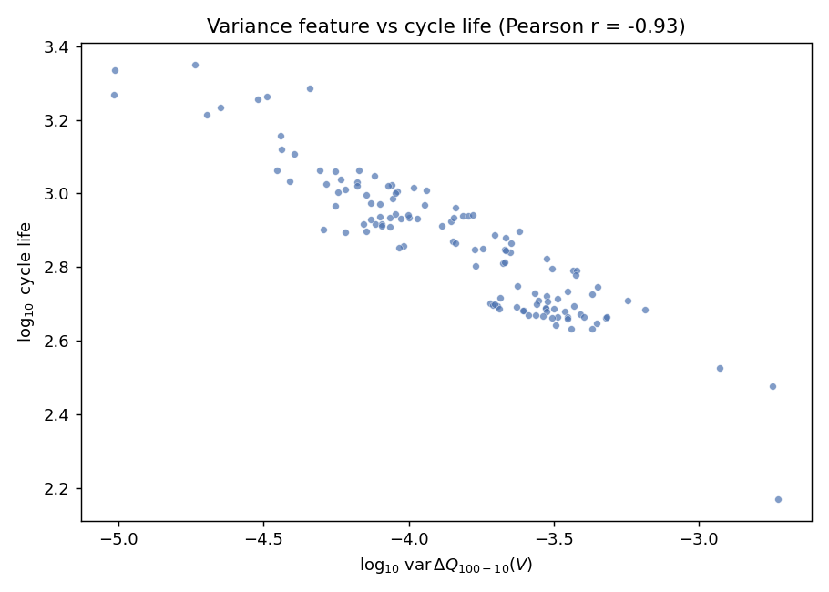
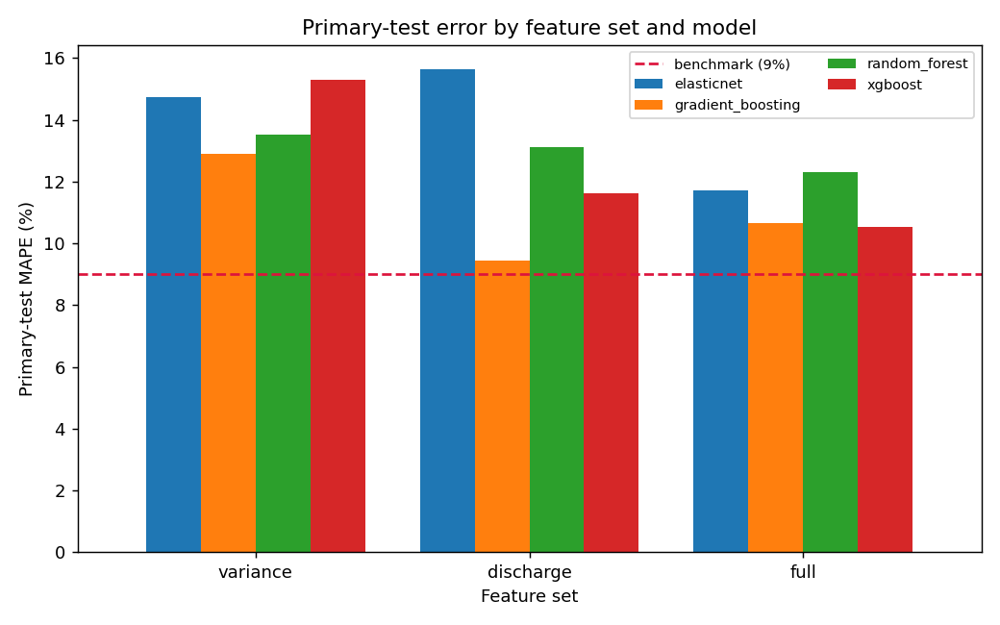

# Battery Remaining-Useful-Life (RUL) Prediction

**Predicts a lithium-ion cell's total cycle life from only its first ~100 charge–discharge cycles
— with 9.4 % test error, matching the published 9 % benchmark (Severson et al., *Nature Energy* 2019).**



*Predicted vs actual cycle life. Gray = training cells (memorized by the model), orange = primary
test, green = secondary test (a different manufacturing batch). Points on the dashed line are
perfect predictions.*

---

## Problem & motivation

Validating a battery cell's lifetime by cycling it to failure takes months to years. Predicting
cycle life from just the first few cycles — before meaningful capacity fade is visible — enables
far faster cell screening, manufacturing QA, second-life sorting, and warranty modeling. It is both
a real industry problem and a recognized ML benchmark.

**Task:** regression — predict total cycle life (cycles until capacity drops to 80 % of nominal)
from features extracted from a cell's **first 100 cycles**.

## Dataset

**Severson / MIT–Stanford / Toyota Research (2019)** — 124 commercial LFP/graphite cells (A123
APR18650M1A, 1.1 Ah), fast-charged under 72 policies at 30 °C and cycled to failure. Cycle lives
span ~150–2300. Public via the Toyota Research Institute portal (`data.matr.io`). Raw data is
**not committed** — see [`data/README.md`](data/README.md) for source, license, and how to obtain it.

> Severson, K.A., Attia, P.M., et al. *"Data-driven prediction of battery cycle life before capacity
> degradation."* **Nature Energy 4, 383–391 (2019).** https://doi.org/10.1038/s41560-019-0356-8

## Approach

A reproducible pipeline, not a single notebook:

1. **Acquire** the three raw `.mat` batches → `data/raw/` (gitignored). — [`src/data/download.py`](src/data/download.py)
2. **Parse & clean** MATLAB v7.3/HDF5 → tidy parquet, reproducing the paper's exact cell exclusions,
   cross-batch merges, and the 41/43/40 train/primary-test/secondary-test split. — [`src/data/preprocess.py`](src/data/preprocess.py)
3. **EDA** — capacity-fade curves, cycle-life distribution, ΔQ(V) curves. — [`notebooks/01_eda.ipynb`](notebooks/01_eda.ipynb)
4. **Feature sets** (nested: `variance` ⊂ `discharge` ⊂ `full`), each feature documented. — [`src/features/build_features.py`](src/features/build_features.py)
5. **Model** — regularized linear baseline (reproduces the paper) → RandomForest / GradientBoosting / XGBoost. — [`src/models/`](src/models/)
6. **Evaluate** — RMSE/MAE/MAPE on held-out splits, parity/residual/importance figures, honest benchmark comparison. — [`reports/results.md`](reports/results.md)

The central signal is **ΔQ(V) = Q_discharge(cycle 100) − Q_discharge(cycle 10)**: even before
capacity fade is visible, the *shape change* of the discharge curve encodes degradation. A single
feature — `log10 var(ΔQ(V))` — correlates with log cycle life at **r ≈ −0.93**:



## Results

Primary-test **MAPE (%)** on cycle life (the paper's headline metric). Full table incl. RMSE/MAE and
the secondary test in [`reports/results.md`](reports/results.md).

| Feature set | Best model | Primary-test MAPE | Secondary-test MAPE | Benchmark |
|---|---|---|---|---|
| variance (1 feature) | ElasticNet | 14.7 % | 11.4 % | ~15 % (paper, variance model) |
| discharge (6) | **Gradient Boosting** | **9.4 %** | 12.1 % | ~9 % (paper, full model) |
| full (9) | XGBoost | 10.5 % | 11.7 % | ~9 % |



**Honest reading:** the single-feature variance baseline already reproduces the paper's central
result. Tree ensembles reach the 9 % benchmark on the primary test but **overfit** the 41-cell
training set (train MAPE ≈ 0) and only marginally beat the robust linear models on held-out data —
and don't dominate on the secondary test, the true cross-batch generalization check.

## Reproduce

**Prerequisites:** Python 3.11. On macOS, XGBoost needs OpenMP: `brew install libomp` (the linear and
tree baselines run without it; only XGBoost requires it).

```bash
make install      # venv + pinned deps + editable install (CPU-only)
make download     # fetch ~8 GB raw Severson batches (see data/README.md)
make pipeline     # process → features → train → evaluate (~1 min after download)
make test         # run the test suite
make eda          # launch the notebooks
```

`make download` runs once (~8 GB); `make pipeline` reproduces all numbers and figures in ~1 minute
on a laptop CPU. Everything is seeded.

## What I learned / limitations / next steps

- **The validation protocol matters more than the model.** Respecting the dataset's train /
  primary-test / secondary-test split and doing CV only within train is what makes the 9 % number
  trustworthy; it's the first thing a reviewer should check for leakage.
- **On small data, simpler is safer.** With 41 training cells, regularized linear regression is
  competitive with gradient boosting and generalizes more consistently across batches.
- **Where the model fails:** the longest-lived cells (~2000+ cycles) are systematically
  under-predicted — there are few of them to learn from (visible in the parity plot).
- **Next steps:** a probabilistic model with calibrated uncertainty; the SOH-trajectory (capacity vs
  future cycle) stretch task; and the optional Streamlit demo in [`app/`](app/streamlit_app.py).

## Citation & acknowledgements

Dataset and benchmark: Severson et al., *Nature Energy* 2019 (full citation above). This repository
is an independent reimplementation for portfolio/educational purposes and does not redistribute the
dataset. Cell-cleaning recipe and feature definitions cross-checked against the paper's official
repository and the BatteryML project.

## License

[MIT](LICENSE) © 2026 Amirreza Roodsaz
