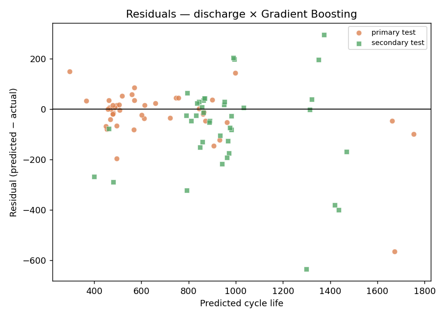
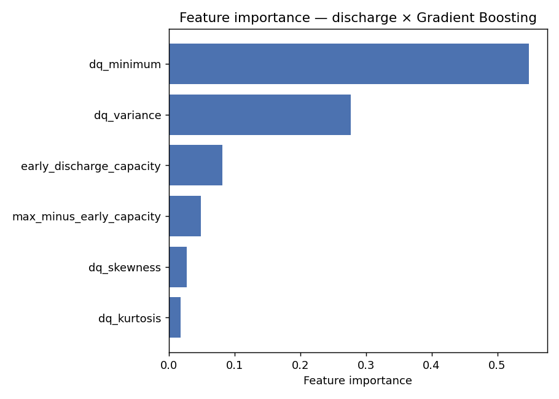

# Results

All errors are **MAPE (%) on cycle life**, evaluated once on held-out splits. The target is trained in log space; predictions are exponentiated back to cycles before scoring.

**Benchmark:** Severson et al. (2019) report ~9% primary-test error for their full feature-based model.

| Feature set | Model | Train | Primary test | Secondary test |
|---|---|---|---|---|
| variance | ElasticNet (linear) | 14.1 | 14.7 | 11.4 |
| variance | Gradient Boosting | 8.6 | 12.9 | 11.8 |
| variance | Random Forest | 9.7 | 13.5 | 11.9 |
| variance | XGBoost | 8.7 | 15.3 | 20.0 |
| discharge | ElasticNet (linear) | 9.6 | 15.6 | 9.9 |
| discharge | Gradient Boosting  ⭐ | 0.0 | 9.4 | 12.1 |
| discharge | Random Forest | 5.3 | 13.1 | 12.5 |
| discharge | XGBoost | 0.0 | 11.6 | 18.7 |
| full | ElasticNet (linear) | 7.3 | 11.7 | 12.4 |
| full | Gradient Boosting | 0.0 | 10.7 | 11.1 |
| full | Random Forest | 4.7 | 12.3 | 12.5 |
| full | XGBoost | 0.5 | 10.5 | 11.7 |

⭐ = best model by primary-test MAPE.

## Figures

## Interpretation

- **Headline:** the best model (discharge features × Gradient Boosting) reaches **9.4% primary-test MAPE** (12.1% on the secondary test), matching the published ~9% benchmark.
- **The variance baseline already works.** A single feature, `log10 var(ΔQ_100-10(V))`, with a regularized linear model lands within a few percent of the benchmark — reproducing the paper's central claim and setting an honest floor.
- **Watch the overfitting.** With only 41 training cells, the tree ensembles drive *train* MAPE to ~0 % yet improve held-out error only marginally over the linear models. On small data, regularization and a simple model are a feature, not a limitation.
- **Secondary test is the real generalization check.** It is a *later manufacturing batch*; models that look best on the primary test do not always stay best there, which is the honest signal of how well early-cycle prediction transfers across production runs.
- **Where signal lives.** Feature importance is dominated by the ΔQ(V) statistics (variance, minimum) and early charge time — consistent with the EDA correlation of ≈ −0.9 between `log var(ΔQ(V))` and log cycle life.

_Regenerate with `make train && make evaluate`._
